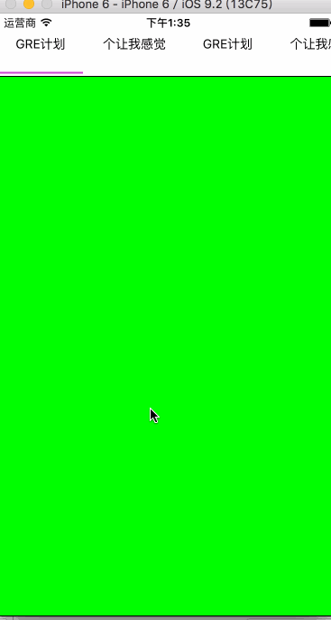

# 使用CollectionView实现滑动切换

最近碰到一个滑动切换视图的需求，上面的标题跟下面的视图需要对应，而且下面的视图不是固定的样式，为了避免`ScrollView`关于`ContentOffset`的计算，打算使用`CollectionView`来实现这个功能。

###  设计思想
	
为了实现上方的标题跟下方的视图联动的效果，考虑到`CollectionView`横向滑动以及`ScrollView`整页滑动的特性，分上下两部分来实现。

* 上方标题
	
	采用`CollectionView`实现，自定义`cell`之后不需要人为的处理坐标的计算，默认一屏显示4个标题

* 下方视图

	基于`CollectionView`横向整页滑动的特性，每个cell占用一屏的宽度，每次滑动根据底部`CollectionView`将要显示的`indexPath`，联动顶部的标题。

### 效果



### 代码实现

1. 新建一个滑动切换视图`JSHorizontalCollectionView`，xib内上方、下方各放一个`CollectionView`，布置好约束，加好属性

	```
	/** 顶部 */
	@property (weak, nonatomic) IBOutlet UICollectionView *topCollectionView;
	/** title array */
	@property (nonatomic, strong) NSArray *titleArray;
	/** title Height */
	@property (nonatomic, assign) CGFloat titleHeight;
	/** 底部 */
	@property (weak, nonatomic) IBOutlet UICollectionView *bottomCollectionView;
	/** view array */
	@property (nonatomic, strong) NSArray *viewArray;
	/** view Height */
	@property (nonatomic, assign) CGFloat viewHeight;
	```

2. 实现`UICollectionViewDataSource, UICollectionViewDelegate, UICollectionViewDelegateFlowLayout`，下方的视图`CollectionView`每个`cell`的宽度父类视图的宽度，添加自定义`cell`

	```
	#pragma mark - datasource & delegate
	- (NSInteger)numberOfSectionsInCollectionView:(UICollectionView *)collectionView
	{
	    return 1;
	}
	
	- (NSInteger)collectionView:(UICollectionView *)collectionView numberOfItemsInSection:(NSInteger)section
	{
	    NSInteger tmpNum = 0;
	    switch (collectionView.tag) {
	        case TopCollectionViewTag: {
	            tmpNum = self.titleArray.count;
	            break;
	        }
	        case BottomCollectionViewTag: {
	            tmpNum = self.viewArray.count;
	            break;
	        }
	        default:
	            break;
	    }
	    return tmpNum;
	}
	
	- (CGSize)collectionView:(UICollectionView *)collectionView layout:(UICollectionViewLayout*)collectionViewLayout sizeForItemAtIndexPath:(NSIndexPath *)indexPath
	{
	    CGSize tmpSize = CGSizeZero;
	    switch (collectionView.tag) {
	        case TopCollectionViewTag: {
	            tmpSize = CGSizeMake(self.collectionWidth / (CGFloat)DefinedCollections, self.titleHeight);
	            break;
	        }
	        case BottomCollectionViewTag: {
	            tmpSize = CGSizeMake(self.collectionWidth, self.viewHeight);
	            break;
	        }
	        default:
	            break;
	    }
	    return tmpSize;
	}
	
	- (UICollectionViewCell *)collectionView:(UICollectionView *)collectionView cellForItemAtIndexPath:(NSIndexPath *)indexPath
	{
	    UICollectionViewCell *cell = nil;
	    switch (collectionView.tag) {
	        case TopCollectionViewTag: {
	            JSHorizontalTopCollectionViewCell *tmpCell = [JSHorizontalTopCollectionViewCell horizontalTopCollectionViewCellWithCollectionView:collectionView forIndexPath:indexPath];
	            [tmpCell loadDataWithTitle:self.titleArray[indexPath.item]];
	            cell = tmpCell;
	            break;
	        }
	        case BottomCollectionViewTag: {
	            JSHorizontalBottomCollectionViewCell *tmpCell = [JSHorizontalBottomCollectionViewCell horizontalBottomCollectionViewCellWithCollectionView:collectionView forIndexPath:indexPath];
	            
	            [tmpCell loadDataWithView:self.viewArray[indexPath.item]];
	            
	            UIColor *color = [UIColor yellowColor];
	            if (indexPath.item % 2 == 0) {
	                color = [UIColor blueColor];
	            }
	            tmpCell.backgroundColor = color;
	            cell = tmpCell;
	            break;
	        }
	        default:
	            break;
	    }
	    return cell;
	}
	```

3. 实现上方标题点击对应的下方视图滑动到相应位置的方法

	```
	- (void)collectionView:(UICollectionView *)collectionView didSelectItemAtIndexPath:(NSIndexPath *)indexPath
	{
	    switch (collectionView.tag) {
	        case TopCollectionViewTag: {
	            JSHorizontalTopCollectionViewCell *cell = (JSHorizontalTopCollectionViewCell *)[collectionView cellForItemAtIndexPath:indexPath];
	            cell.selected = YES;
	            
	            [self.bottomCollectionView scrollToItemAtIndexPath:indexPath atScrollPosition:UICollectionViewScrollPositionCenteredHorizontally animated:YES];
	            
	            break;
	        }
	        case BottomCollectionViewTag: {
	            break;
	        }
	        default:
	            break;
	    }
	}
	
	- (void)collectionView:(UICollectionView *)collectionView didDeselectItemAtIndexPath:(NSIndexPath *)indexPath
	{
	    switch (collectionView.tag) {
	        case TopCollectionViewTag: {
	            JSHorizontalTopCollectionViewCell *cell = (JSHorizontalTopCollectionViewCell *)[collectionView cellForItemAtIndexPath:indexPath];
	            cell.selected = NO;
	            break;
	        }
	        case BottomCollectionViewTag: {
	            break;
	        }
	        default:
	            break;
	    }
	}
	```

4. 实现下方视图滑动，联动上方标题的方法

	```
	- (void)collectionView:(UICollectionView *)collectionView willDisplayCell:(UICollectionViewCell *)cell forItemAtIndexPath:(NSIndexPath *)indexPath
	{
	    if (collectionView.tag == BottomCollectionViewTag) {
	        [self.topCollectionView selectItemAtIndexPath:indexPath animated:YES scrollPosition:UICollectionViewScrollPositionCenteredHorizontally];
	        [self.topCollectionView scrollToItemAtIndexPath:indexPath atScrollPosition:UICollectionViewScrollPositionCenteredHorizontally animated:YES];
	    }
	}
	```

### 存在的问题

1. 下方的视图暂时使用数组的方式赋值，但是感觉上不是太好，而且每个视图创建的时候布局比较让人头疼，这个如果修改为约束是不是会好一些？
2. 上方的标题目前暂定是四个，如果少于四个的时候不太好看，考虑后期继续处理


